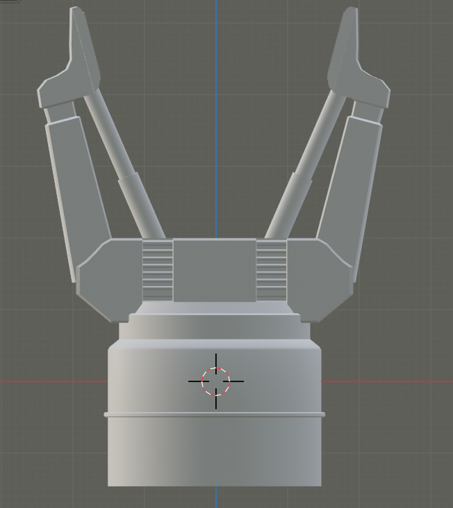
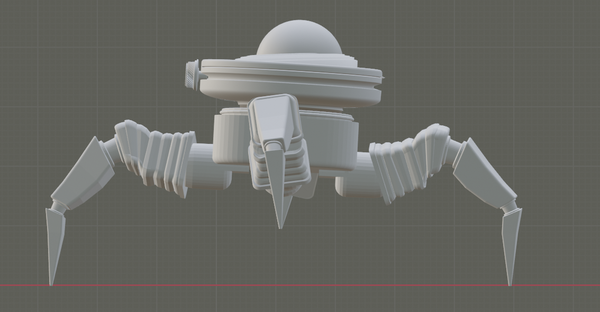
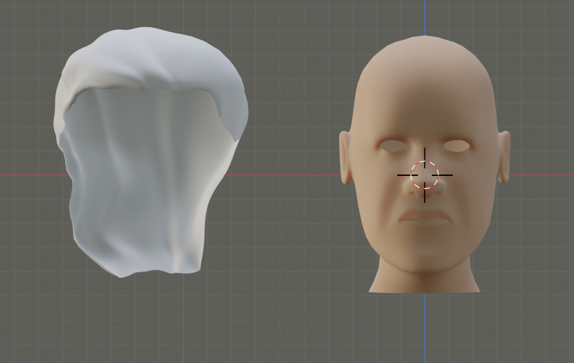
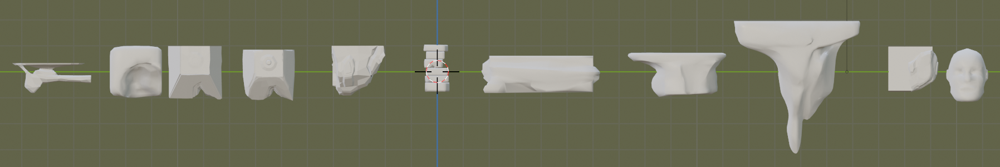
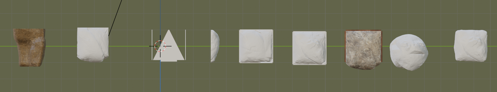
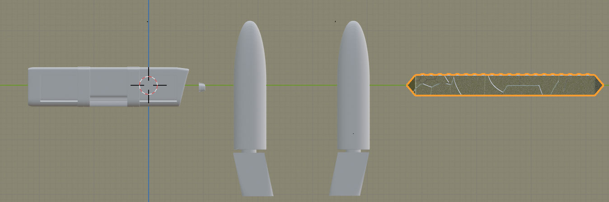
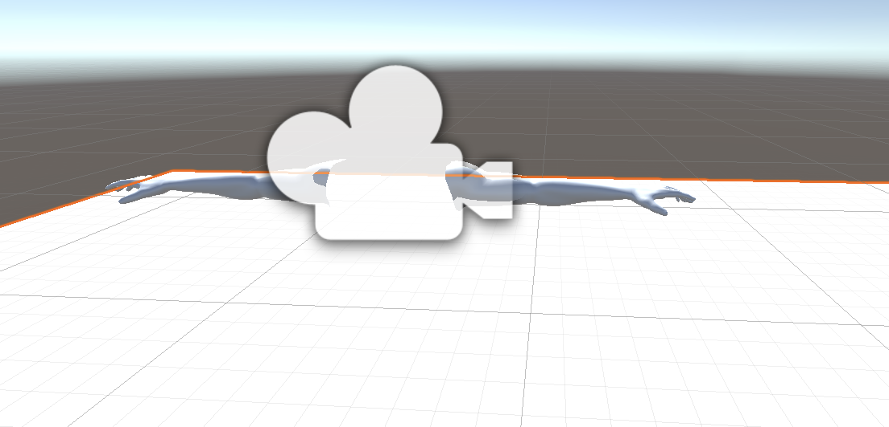

  <h1>Unity-Delboy</h1>
  <h2>Delboy is a unity build platform game</h2>  
   
What has been done
 
     <ul>      
      <li>Blender:</li>
         <ul>
          <li>objects has been created such as platforms, character attributes and other</li>
          <li>character and other objects has been rigged</li>
         </ul>
      <li>Unity</li>
        <ul>
          <li>Player can move and jump</li>
          <li>Camera followes and pivots with player movement</li>
       </ul>
    </ul>
  
  <h2>Goals</h2>
  
to create a realistic first person platform game. Where you climb a complex mountain, to reach to the top you have to collect items and use strategies to reach the top. objects in the game can help you move around the mountain.

  
  <h2>Screenshots</h2>
  

  
  
  

  

